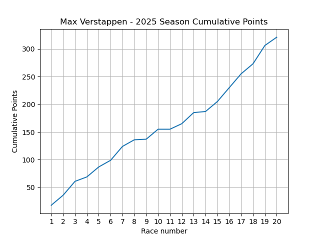

# 🌿 Moss

Moss is a modern interpreted language with a simple C-style syntax.

Moss natively supports generation of output in many formats, such as Markdown,
HTML and others. New formats and convertors can be also easily added.

Moss can also be compiled into bytecode for faster execution or non-source
sharing.

This document was also generated by Moss and all code examples are run in
"notebook" mode and output shown.

# 💡 Language examples

The example bellow showcases some nice Moss features, such as typed function
arguments, ranges (`start..end`), calls to standard library functions (`sum` in
space `Math`), list comprehension, documentation strings and outputting.
```moss
fun normalized_squares(start:Int, end:Int) {
    d"""
    Return list of squared numbers normalized to sum to 1.
    Numbers are in a range from `start` to `end`.
    """
    squares = [x^2 : x = start..end]
    total = Math.sum(squares)
    return [x / Float(total) : x = squares]
}
```
```moss
normalized_squares(1, 6)
```
_[Output]:_
```
[0.018182, 0.072727, 0.163636, 0.290909, 0.454545]
```

As seen above in output for this function the return value was outputted.
This is a big feature of Moss, where standalone expressions are outputted in
specified format (in this case "text"). This is great for creating interactive
notebooks and documents with runnable code that is recomputed on every
generation. On top of that this output can be then easily converted to other
formats (by specifying `-f` option followed by the desired format).

## 🐍 Python interoperability

Moss has a built-in Python interoperability to take advantage of a wast library
ecosystem which Python offers. This should also allow for easier implementation
of Moss into existing projects which rely on existing Python scripts.

Working with python is very straight forward, Moss has PythonObject wrapper
over Python objects. Here is an example of plotting a graph using
[matplotlib](https://matplotlib.org/):
```moss
space {
    import python.*

    plt = module("matplotlib.pyplot")

    points = [18, 18, 25, 8, 18, 12, 25, 12, 1, 18, 0, 10, 20, 2, 18, 25, 25, 18, 33, 15]
    accum = Math.cumsum(points)
    races = [i : i = 1..points.length()+1]

    ~plt.plot(races, accum)
    ~plt.title("Max Verstappen - 2025 Season Cumulative Points")
    ~plt.xlabel("Race Number")
    ~plt.ylabel("Cumulative Points")
    ~plt.xticks(races)
    ~plt.grid(true)
    ~plt.savefig("docs/resources/ver_points.png")
    ~plt.close.call()
}
```

> [!Note]
> Calls to "void" functions are prefixed with silence operator `~` so that `nil` is not outputted.

Moss also has built-in interoperability with C and any C-calling convention functions (see `cffi` module).

## 📚 Other useful resources

* [Language reference documentation](https://github.com/mark-sed/moss-lang/tree/main/docs/language-reference)
* [Wiki pages](https://github.com/mark-sed/moss-lang/wiki)

## 🛠️ Building Moss

Moss can be built and run on Linux and Windows. On MacOS it should be possible,
but is not tested yet.

### 📦 Requirement
* C++17 compatible compiler (gcc, clang),
* CMake,
* Python 3 (as Moss has a built-in interoperability).

### ⚙️ Build

Clone this git repository:
```sh
git clone --recursive https://github.com/mark-sed/moss-lang.git
cd moss-lang
```

Moss can be built using CMake with specified targets or on Linux using pre-made
`install.sh` script. This script requires sudo privileges to install into
`/usr/` and `/bin/`:
```sh
sudo bash instal.sh
```

With CMake it can be done with target `moss` and `libms`. If you wish to also
install it onto correct path (to have command `moss`) you can use `installation`
target.

__On Linux:__
```sh
cmake -S . -B build -DCMAKE_BUILD_TYPE=Release
cmake --build build -j $(nproc) --target moss libms
sudo cmake --build build -j $(nproc) --target installation
```

__On Windows:__

Open `Developer Command Prompt` and navigate into cloned moss-lang directory. 
```sh
cmake -S . -B build
cmake --build build --config Release --target moss libms installation
```

You can test this with:
```sh
# On Linux
./build/moss --version

# On Windows
build\\Release\\moss.exe --version
```

-----
This file was generated on Nov 04 2025 by 
[Moss](https://github.com/mark-sed/moss-lang) 0.7.0
from [readme.ms](https://github.com/mark-sed/moss-lang/blob/main/docs/readme.ms).
